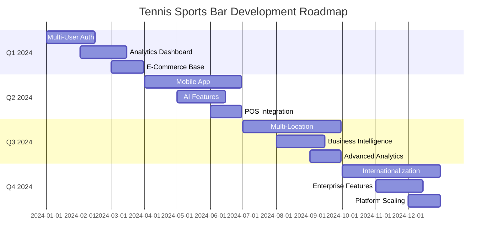
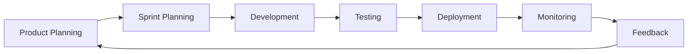

# 🚀 Roadmap Tennis Sports Bar 2024-2025

> **Piano strategico di sviluppo per l'evoluzione della piattaforma Tennis Sports Bar**

---

## 📅 Timeline Overview



---

## 🎯 Q1 2024 - Foundation Enhancement

### 🔐 **Phase 1.1: Advanced Authentication System**
**Timeline**: Gennaio 2024 (2 settimane)

#### Obiettivi
- Sostituire sistema PIN con autenticazione multi-utente
- Implementare ruoli e permessi granulari
- Aggiungere sicurezza avanzata

#### Implementazioni Tecniche

```typescript
// New User Schema
interface User {
  _id: ObjectId
  email: string
  password: string // hashed
  role: 'admin' | 'manager' | 'staff'
  permissions: Permission[]
  profile: {
    firstName: string
    lastName: string
    avatar?: string
  }
  sessions: Session[]
  createdAt: Date
  lastLogin: Date
  isActive: boolean
}

interface Permission {
  resource: 'menu' | 'orders' | 'analytics' | 'users' | 'settings'
  actions: ('create' | 'read' | 'update' | 'delete')[]
}
```

#### Features Principali
- **OAuth Integration**: Login con Google/Microsoft
- **Role-Based Access Control (RBAC)**: Permessi granulari per risorsa
- **Multi-Factor Authentication**: SMS/Email/Authenticator app
- **Session Management**: Dashboard sessioni attive, logout remoto
- **Password Policies**: Requisiti sicurezza, scadenza password

#### API Endpoints
```
POST /api/auth/login
POST /api/auth/logout
POST /api/auth/register
GET  /api/auth/me
POST /api/auth/refresh
POST /api/auth/forgot-password
POST /api/auth/reset-password
GET  /api/auth/sessions
DELETE /api/auth/sessions/:id
```

---

### 📊 **Phase 1.2: Analytics & Reporting System**
**Timeline**: Febbraio 2024 (3 settimane)

#### Dashboard Analytics Completa

```typescript
interface AnalyticsDashboard {
  overview: {
    totalItems: number
    activeItems: number
    categoriesCount: number
    lastUpdate: Date
  }
  usage: {
    dailyViews: TimeSeriesData[]
    popularItems: ItemPopularity[]
    searchQueries: SearchAnalytics[]
    userBehavior: BehaviorMetrics
  }
  performance: {
    pageLoadTimes: PerformanceMetrics[]
    apiResponseTimes: APIMetrics[]
    errorRates: ErrorAnalytics[]
  }
}
```

#### Features Implementate
- **Real-time Metrics**: WebSocket per aggiornamenti in tempo reale
- **Custom Reports**: Builder drag-and-drop per report personalizzati
- **Data Export**: Excel, PDF, CSV export con scheduling
- **Trend Analysis**: ML-powered insights su trend di utilizzo
- **Performance Monitoring**: Lighthouse scores, Core Web Vitals

#### Visualizzazioni
- **Charts interattivi**: Chart.js/D3.js per visualizzazioni avanzate
- **Heat Maps**: Mappe di calore per popolarità items
- **Funnel Analysis**: Analisi percorso utente
- **A/B Testing**: Framework per testing varianti

---

### 🛒 **Phase 1.3: E-Commerce Foundation**
**Timeline**: Marzo 2024 (4 settimane)

#### Sistema Ordinazioni Base

```typescript
interface Order {
  _id: ObjectId
  orderNumber: string
  customer: CustomerInfo
  items: OrderItem[]
  status: 'pending' | 'confirmed' | 'preparing' | 'ready' | 'completed' | 'cancelled'
  type: 'pickup' | 'delivery' | 'dine-in'
  payment: PaymentInfo
  timing: {
    orderedAt: Date
    confirmedAt?: Date
    estimatedReady: Date
    completedAt?: Date
  }
  total: number
  notes?: string
}

interface OrderItem {
  menuItemId: ObjectId
  name: string
  quantity: number
  price: number
  customizations?: Customization[]
  notes?: string
}
```

#### Payment Integration
- **Stripe Integration**: Carte di credito, Google Pay, Apple Pay
- **PayPal Integration**: Pagamenti PayPal e Pay Later
- **Cash Handling**: Gestione pagamenti contanti per pickup
- **Refund Management**: Sistema rimborsi automatici

#### Order Management
- **Kitchen Display**: Interface per cucina con timer
- **Customer Notifications**: SMS/Email updates su stato ordine
- **Inventory Sync**: Sincronizzazione automatica disponibilità
- **Queue Management**: Gestione code e tempi di attesa

---

## 🚀 Q2 2024 - Mobile & AI Enhancement

### 📱 **Phase 2.1: React Native Mobile App**
**Timeline**: Aprile-Giugno 2024 (3 mesi)

#### App Architecture
```typescript
// React Native + Expo Architecture
TennisSportsBarApp/
├── src/
│   ├── screens/
│   │   ├── Menu/
│   │   ├── Order/
│   │   ├── Profile/
│   │   └── Admin/
│   ├── components/
│   ├── navigation/
│   ├── services/
│   ├── store/ (Redux Toolkit)
│   └── utils/
├── ios/
├── android/
└── app.json
```

#### Core Features
- **Offline Menu**: Caching menu per visualizzazione offline
- **Push Notifications**: Notifiche promozioni e aggiornamenti ordini
- **QR Code Scanner**: Scan per accesso rapido menu e ordini
- **Geolocation**: Rilevamento posizione per delivery
- **Biometric Auth**: Face ID/Touch ID per login rapido

#### Advanced Features
- **AR Menu**: Realtà aumentata per visualizzazione piatti
- **Voice Ordering**: Ordinazioni vocali con AI
- **Social Sharing**: Condivisione items sui social
- **Loyalty Program**: Sistema punti e rewards

---

### 🤖 **Phase 2.2: AI & Machine Learning Features**
**Timeline**: Maggio-Giugno 2024 (6 settimane)

#### Recommendation Engine
```python
# AI/ML Backend (Python + FastAPI)
from fastapi import FastAPI
from tensorflow import keras
import pandas as pd

class RecommendationEngine:
    def __init__(self):
        self.model = keras.models.load_model('menu_recommendation_model.h5')
        self.user_embeddings = self.load_user_embeddings()
        self.item_embeddings = self.load_item_embeddings()
    
    def get_recommendations(self, user_id: str, context: dict) -> List[str]:
        user_vector = self.get_user_vector(user_id)
        context_vector = self.get_context_vector(context)
        
        predictions = self.model.predict([user_vector, context_vector])
        return self.format_recommendations(predictions)
```

#### AI Features
- **Smart Recommendations**: ML per suggerimenti personalizzati
- **Demand Forecasting**: Previsioni richiesta prodotti con LSTM
- **Dynamic Pricing**: Algoritmi pricing dinamico
- **Customer Segmentation**: Clustering clienti per marketing
- **Chatbot Assistant**: AI assistant per supporto clienti

#### Implementation Stack
- **Backend**: Python + FastAPI + TensorFlow
- **Data Pipeline**: Apache Airflow per ETL
- **Vector Database**: Pinecone per similarity search
- **Model Serving**: TensorFlow Serving + Docker

---

### 🔗 **Phase 2.3: POS & Inventory Integration**
**Timeline**: Giugno 2024 (4 settimane)

#### POS System Integration
```typescript
interface POSIntegration {
  provider: 'Square' | 'Toast' | 'Shopify' | 'Custom'
  endpoints: {
    transactions: string
    inventory: string
    customers: string
  }
  auth: {
    apiKey: string
    webhook: string
  }
  sync: {
    realTime: boolean
    batchInterval: number
  }
}
```

#### Inventory Management
- **Real-time Sync**: Sincronizzazione inventory tra POS e menu
- **Low Stock Alerts**: Notifiche automatiche stock basso
- **Automatic Disabling**: Disabilitazione automatica items esauriti
- **Batch Updates**: Aggiornamenti massivi prezzi e disponibilità

---

## 🏢 Q3 2024 - Enterprise & Scaling

### 🌐 **Phase 3.1: Multi-Location Support**
**Timeline**: Luglio-Settembre 2024 (3 mesi)

#### Multi-Tenant Architecture
```typescript
interface Location {
  _id: ObjectId
  franchiseId: ObjectId
  name: string
  address: Address
  settings: LocationSettings
  menu: MenuOverrides
  staff: User[]
  analytics: LocationAnalytics
  isActive: boolean
}

interface MenuOverrides {
  hiddenItems: ObjectId[]
  priceOverrides: PriceOverride[]
  locationSpecificItems: MenuItem[]
  customCategories: Category[]
}
```

#### Franchise Management
- **Centralized Control**: Dashboard unificata multi-sede
- **Location-Specific Menus**: Menu e prezzi personalizzati per location
- **Staff Management**: Gestione personale multi-sede con permessi
- **Cross-Location Analytics**: Analisi comparative tra sedi

---

### 📈 **Phase 3.2: Business Intelligence Platform**
**Timeline**: Agosto-Settembre 2024 (6 settimane)

#### Advanced Analytics Engine
```sql
-- Data Warehouse Schema
CREATE TABLE fact_orders (
    order_id VARCHAR(50) PRIMARY KEY,
    location_id VARCHAR(50),
    customer_id VARCHAR(50),
    order_date DATE,
    order_time TIME,
    total_amount DECIMAL(10,2),
    item_count INT,
    order_type VARCHAR(20)
);

CREATE TABLE dim_menu_items (
    item_id VARCHAR(50) PRIMARY KEY,
    item_name VARCHAR(100),
    category VARCHAR(50),
    subcategory VARCHAR(50),
    cost DECIMAL(8,2),
    price DECIMAL(8,2),
    profit_margin DECIMAL(5,2)
);
```

#### BI Features
- **Executive Dashboard**: KPIs per management
- **Competitive Analysis**: Monitoring prezzi concorrenza
- **Market Trends**: Analisi trend mercato con external data
- **ROI Calculator**: Calcolatore ritorno investimenti marketing
- **Predictive Analytics**: Previsioni vendite e staging

---

## 🌍 Q4 2024 - Global Expansion

### 🌐 **Phase 4.1: Internationalization**
**Timeline**: Ottobre-Dicembre 2024 (3 mesi)

#### i18n Implementation
```typescript
// Internationalization Structure
locales/
├── en/
│   ├── common.json
│   ├── menu.json
│   ├── admin.json
│   └── errors.json
├── it/
├── es/
├── fr/
├── de/
└── ar/ (RTL support)

// React i18n Hook
export function useTranslation(namespace: string) {
  const { locale } = useRouter()
  const [translations, setTranslations] = useState({})
  
  useEffect(() => {
    import(`../locales/${locale}/${namespace}.json`)
      .then(setTranslations)
  }, [locale, namespace])
  
  return { t: (key: string) => translations[key] || key }
}
```

#### Global Features
- **Multi-Language Support**: 10+ lingue con fallback
- **Multi-Currency**: 20+ valute con conversione real-time
- **Localization**: Adattamento mercati locali (date, numeri, tasse)
- **RTL Support**: Supporto lingue right-to-left (Arabo, Ebraico)
- **Regional Compliance**: GDPR, CCPA, altre normative

---

### 🚀 **Phase 4.2: Enterprise Platform Features**
**Timeline**: Novembre-Dicembre 2024 (8 settimane)

#### Enterprise Architecture
```typescript
interface EnterpriseFeatures {
  multiTenancy: {
    isolation: 'database' | 'schema' | 'tenant_id'
    customDomains: boolean
    whiteLabeling: boolean
  }
  compliance: {
    soc2: boolean
    hipaa: boolean
    gdpr: boolean
    auditLogs: boolean
  }
  integrations: {
    sso: ['SAML', 'OAuth2', 'LDAP']
    apis: ['REST', 'GraphQL', 'Webhooks']
    exports: ['PDF', 'Excel', 'API']
  }
}
```

#### Enterprise Features
- **White-Label Solutions**: Branding personalizzato per clienti
- **API Marketplace**: Marketplace integrazioni third-party
- **Enterprise SSO**: Single Sign-On con Active Directory
- **Advanced Permissions**: RBAC granulare enterprise-grade
- **SLA Monitoring**: Monitoring uptime e performance SLA

---

## 🔮 2025 Vision - Next Generation Platform

### 🚀 **Emerging Technologies Integration**

#### Blockchain & Web3
```solidity
// Smart Contract per Loyalty Program
pragma solidity ^0.8.0;

contract TennisBarLoyalty {
    mapping(address => uint256) public points;
    mapping(address => bool) public members;
    
    event PointsEarned(address customer, uint256 points);
    event PointsRedeemed(address customer, uint256 points);
    
    function earnPoints(address customer, uint256 amount) external {
        require(members[customer], "Not a member");
        points[customer] += amount;
        emit PointsEarned(customer, amount);
    }
}
```

#### Metaverse Integration
- **Virtual Restaurant**: Spazi virtuali 3D per esperienze immersive
- **NFT Menu Items**: Items menu limitati come NFT collectibili
- **Crypto Payments**: Pagamenti con Bitcoin, Ethereum, stablecoins
- **DAO Governance**: Voting decentralizzato per menu changes

#### Advanced AI
- **Computer Vision**: Riconoscimento automatico piatti per inventario
- **NLP Processing**: Analisi sentiment reviews e feedback
- **Predictive Maintenance**: AI per manutenzione predittiva equipment
- **Autonomous Ordering**: AI agents per ordinazioni automatiche

---

## 💰 Investment & ROI Projections

### Budget Allocation

```
Total Investment 2024: €125,000

Q1 2024: €35,000
- Auth System: €15,000
- Analytics: €12,000
- E-Commerce: €8,000

Q2 2024: €40,000
- Mobile App: €25,000
- AI Features: €10,000
- POS Integration: €5,000

Q3 2024: €30,000
- Multi-Location: €20,000
- Business Intelligence: €10,000

Q4 2024: €20,000
- Internationalization: €12,000
- Enterprise Features: €8,000
```

### ROI Projections

```
Year 1 ROI: 180%
- Revenue Increase: 45% (digital ordering, upselling)
- Cost Reduction: 25% (automation, efficiency)
- Customer Retention: +35%

Year 2 ROI: 320%
- Market Expansion: 60% (multi-location, international)
- Premium Features: 40% (AI, analytics)
- Enterprise Clients: 80% (B2B expansion)
```

---

## 🎯 Success Metrics & KPIs

### Technical KPIs
- **Performance**: <2s page load time, 99.9% uptime
- **Scalability**: 10k concurrent users, 1M+ menu views/month
- **Security**: Zero data breaches, SOC2 compliance
- **Code Quality**: 90%+ test coverage, A+ code grade

### Business KPIs
- **User Growth**: 500% increase in active users
- **Revenue Growth**: 200% increase in digital orders
- **Market Share**: #1 sports bar platform in target markets
- **Customer Satisfaction**: 4.8+ stars average rating

### Innovation KPIs
- **Feature Velocity**: 2-week release cycles
- **Technology Adoption**: 90% feature adoption rate
- **API Usage**: 1M+ API calls/month
- **Developer Community**: 1000+ developers using platform

---

## 🤝 Partnership Strategy

### Technology Partners
- **Cloud Providers**: AWS, Google Cloud, Azure
- **Payment Processors**: Stripe, PayPal, Square
- **Analytics Providers**: Google Analytics, Mixpanel
- **AI/ML Platforms**: OpenAI, Anthropic, Hugging Face

### Integration Partners
- **POS Systems**: Toast, Square, Shopify
- **Delivery Platforms**: UberEats, DoorDash, Just Eat
- **Marketing Tools**: Mailchimp, HubSpot, Klaviyo
- **Review Platforms**: Google, TripAdvisor, Yelp

### Strategic Alliances
- **Restaurant Chains**: Franchise partnerships
- **Tech Accelerators**: Y Combinator, Techstars
- **Industry Associations**: National Restaurant Association
- **Investment Partners**: VC firms, angel investors

---

## 🔄 Continuous Improvement Framework

### Agile Development Process


### Innovation Pipeline
1. **Research Phase**: Market research, technology scouting
2. **Prototype Phase**: MVP development, user testing
3. **Validation Phase**: A/B testing, feedback collection
4. **Development Phase**: Full feature development
5. **Launch Phase**: Gradual rollout, monitoring
6. **Optimization Phase**: Performance tuning, improvements

### Community Feedback Integration
- **User Advisory Board**: Quarterly feedback sessions
- **Developer Community**: Open source contributions
- **Customer Success Team**: Direct customer feedback loop
- **Market Research**: Regular competitive analysis

---

## 📚 Documentation Strategy

### Technical Documentation
- **API Documentation**: OpenAPI/Swagger specs
- **Architecture Docs**: System design documents
- **Deployment Guides**: Infrastructure as Code
- **Security Docs**: Security best practices

### User Documentation
- **Admin Guides**: Step-by-step admin tutorials
- **Video Tutorials**: YouTube channel with tutorials
- **Knowledge Base**: Searchable help center
- **Training Materials**: Certification programs

### Developer Resources
- **SDK Development**: Multi-language SDKs
- **Code Examples**: GitHub repository with examples
- **Community Forum**: Discord/Slack community
- **Hackathons**: Regular developer events

---

Questa roadmap rappresenta una visione ambiziosa ma realistica per l'evoluzione di Tennis Sports Bar da una semplice applicazione menu a una **piattaforma enterprise completa** che definisce il futuro della digitalizzazione nel settore della ristorazione sportiva. 🚀🎾 